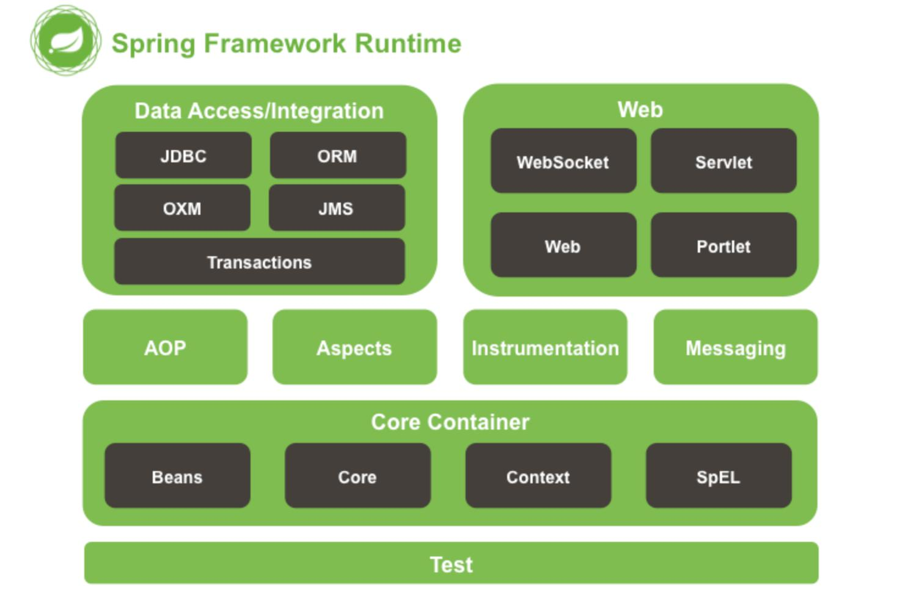

# - Spring核心概念与结构

## 1-2. IoC与AOP

### IoC / DI

**IoC（Inversation of Control，控制反转）**已在前文提到，它是实现SOLID原则中依赖倒置原则（Dependency Inversion Principle）的一种设计思路，即将对象的初始化、对象的销毁等交给容器来管理。

使用IoC有如下好处：方便管理对象之间复杂的依赖关系、便于进行单元测试，方便切换Mock组件、便于进行AOP操作，对业务侵入性小。

**DI（Dependency Injection，依赖注入）**是实现IoC的方法，即由容器动态的将对象的依赖注入到该对象中。

### AOP

**AOP（Aspect Oriented Programming，面向切面编程）**是一种编程思想，旨在通过分离横切关注点来提高模块化，利用AOP可以对业务逻辑的各个部分进行隔离，从而使得业务逻辑各部分之间的耦合度降低，提高程序的可重用性，同时提高了开发效率。主要的应用场景有：日志、安全、性能监控、异常处理等。

IoP是整座Spring大厦的地基，AOP优雅地解决了OOP所无能为力的问题。

### Bean

前文业已介绍，再赘述一番，加强读者（作者）记忆：

JavaBean是一种特殊的类，而**Spring中的bean**指的是一个**对象**。例如，我们要去从service调用dao对象，原先需要我们自己new一个dao对象，而有了Spring之后，所有需要new的对象都可以交给IoC容器根据XML文件去创建，这样的对象就叫做bean。

传统JavaBean作为值对象，要求每个属性都提供getter和setter方法；但Spring中的bean只需为接受设值注入的属性提供setter方法。

传统Javabean作为值对象传递，不接受任何容器管理其生命周期；spring中的bean有spring管理其生命周期行为。

\*此处补充说明一点： BeanFactory 只能管理单例（Singleton）Bean 的生命周期。对于原型（prototype，非单例）Bean，实例被创建之后就被传给了客户端，容器失去了对它们的引用，不再管理其生命周期。关于bean在Spring容器中的生命周期，将在后文进行介绍。

## 1-3. Spring框架结构与核心组件

了解了Spring Framework的前世今生与核心概念，我们来看看它的整体框架：

如上图所示，Spring Framework由20多个模块组成，它们分别是：

* **Test**（测试）：集成了Junit等工具库，便于开发者单元测试。
* **Core Container**（核心容器）：包含了所有核心类库，提供两种类型IoC容器`BeanFactory`和`ApplicationContext`，实现对bean的管理，将在下文进行更多介绍。
* **AOP/Aspects**：包括了Spring自己的AOP和基于AspectJ框架实现的AOP。
* **Instrumentation**（设备）：提供对JVM和Web容器的检测。
* **Messaging**（消息发送）：对Spring集成项目（Message、MessageChanel、MessageHandler）进行抽象，是基于消息发送应用的基础。
* **Data Access/Integration**（数据访问与集成）：集成了JDBC、ORM、OXM、事务（spring-tx）、JMS等模块。
* **Web**：包括了Spring MVC、WebSocket等模块。

其中，**核心容器**Core Container中的组件是Spring的骨架，没有它们就没有AOP这些上层特性功能。其中的`spring-core`，`spring-beans`和`spring-context`模块是实现**控制反转（IoC）**的核心组件。

`spring-core`和`spring-beans`模块提供了框架的基础部分，包含控制反转和依赖注入功能。`spring-context`模块是依赖`spring-core`和`spring-bean`构建的，提供了一种以框架模式获取对象的方式。

Context模块从Beans模块继承了它的特点，并且支持了事件传播，资源加载，透明的上下文创建。**ApplicationContext接口**是Context模块的核心，也是接下来本文重点关心的部分。

至于其它模块，此处按下不表，这里提供了一份Spring Framework的官网参考文档，供感兴趣的读者和作者本人参阅：[https://docs.spring.io/spring-framework/docs/4.3.14.RELEASE/spring-framework-reference/htmlsingle/\#overview-usagescenarios](https://docs.spring.io/spring-framework/docs/4.3.14.RELEASE/spring-framework-reference/htmlsingle/#overview-usagescenarios)

