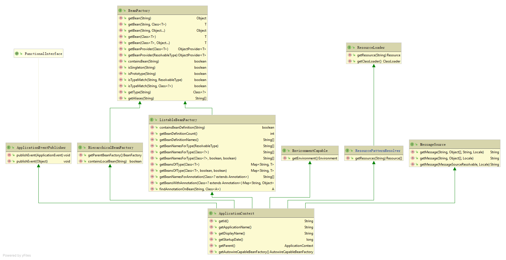
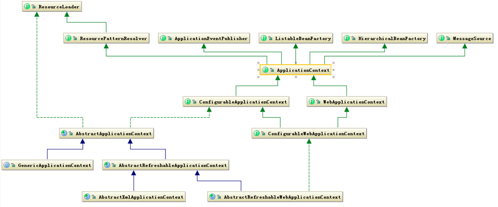

# - ApplicationContext设计

## 2-2. ApplicationContext

打开 `applicationContext.java`文件，我们可以看到 ApplicationContext中定义了以下几种方法：

```java
String getId(); 
String getApplicationName(); 
String getDisplayName(); 

long getStartupDate(); 

ApplicationContext getParent(); 

AutowireCapableBeanFactory getAutowireCapableBeanFactory() throws IllegalStateException;
```

前5种方法用于获取该ApplicationContext的一些基本信息，如id、名字、上下文第一次加载的时间。最后一个 `getAutowireCapableBeanFactory()`用于暴露`AutowireCapableBeanFactory`的功能，通常不是提供给代码使用的，具体可以参考[这篇文章](https://www.cnblogs.com/zhangfengxian/p/11296591.html)。

这几行代码很短，但ApplicationContext很强。这是因为ApplicationContext接口不仅继承自BeanFactory接口，拥有着它的全部功能，它还继承了若干其它接口，让我们用IDEA来查看继承关系UML图（点击查看大图）：



可以想想看，如果我们要自己做一个IoC容器，那么它需要有什么功能呢？

首先，容器是用来管理bean的，那我们就必须要让它有对bean的装配管理功能，于是我们可以继承BeanFactory这个已有的接口，去管理bean。

既然要管理配置bean，那么就需要读取配置文件，所以我们还要有一个能够使得 ApplicationContext可以访问到外部资源的接口，于是我们又去继承了ResourceLoader。

同时，容器本身也不是凭空产生的，在容器初始化、摧毁的时候，可能也需要我们去执行一些操作，这或许就会涉及到事件机制了，于是我们又继承了ApplicationEventPublisher这个接口。

总之，UML呈现出ApplicationContext继承的接口有如下几类：

* `ApplicationEventPublisher`：用于处理事件发布机制。 
* `BeanFactory`：提供了能够管理任何对象的高级配置机制。
  * `ListableBeanFactory`：从该接口的名字就能知道，该接口除了拥有BeanFactory的功能外，该接口还有能列出factory中所有bean的实例的能力。
  * `HierarchicalBeanFactory`：该接口除了拥有BeanFactory的功能外，还提供了BeanFactory分层的机制，查找bean的时候，除了在自身BeanFactory查找外，如果没有查找到，还会在父级BeanFactory进行查找。 
* `EnvironmentCapable`：提供了Environment的访问能力 
* `ResourceLoader`：用于加载资源的策略接口（例如类路径下的资源、系统文件下的资源等等）。
  * `ResourcePatternResolver`：用于将位置模式（例如Ant风格的路径模式）解析成资源对象的策略接口。
  * `classpath*:`前缀能匹配所以类路径下的资源。 
* `MessageSource`：消息资源的处理，用于国际化。

当然，ApplicationContext自己下面也有一大堆子接口：



ApplicationContext 的子接口主要包含两个方面：

**`1、ConfigurableApplicationContext`**

表示该 Context 是可修改的，也就是在构建 Context 中用户可以动态添加或修改已有的配置信息，它下面又有多个子类，其中最经常使用的是可更新的 Context，即 AbstractRefreshableApplicationContext 类，例如，其下提供ApplicationContext接口的三个实现类：

* `ClassPathXmlApplicationContext`：把上下文文件当成类路径资源，从classpath的XML配置文件创建，可以从jar包中读取配置文件。编译路径有三种方式：

```java
ApplicationContext factory = new ClassPathXmlApplicationContext("classpath:applicationContext.xml");
ApplicationContext factory = new ClassPathXmlApplicationContext("applicationContext.xml"); 
ApplicationContext factory = new ClassPathXmlApplicationContext("file:E:/Workspaces/MyEclipse 8.5/Hello/src/applicationContext.xml");
```

* `FileSystemXmlApplicationContext`：从文件系统中的XML文件或者url指定的XML配置文件创建，参数为配置文件名或文件名数组，有相对路径与绝对路径。

```java
ApplicationContext factory=new FileSystemXmlApplicationContext("src/applicationContext.xml");
ApplicationContext factory=new FileSystemXmlApplicationContext("E:/Workspaces/MyEclipse 8.5/Hello/src/applicationContext.xml");
```

* `XmlWebApplicationContext`：从web应用的根目录读取配置文件，需要先在`web.xml`中配置，可以配置监听器或者servlet来实现，具体可以参考[此文](https://www.cnblogs.com/duanxz/p/3507449.html)。

**`2、WebApplicationContext`**

为 web 准备的 Context ，可以直接访问到ServletContext，通常情况下这个接口使用得就较少了。

关于ApplicationContext各子类更加详细具体的功能，请读者参考[这篇文章](https://www.cnblogs.com/zhangfengxian/p/11192054.html)。

总体来说 ，ApplicationContext 必须要完成这些事：

* 标识一个应用环境
* 利用 BeanFactory 创建 Bean 对象
* 保存对象关系表
* 能够捕获各种事件 ……

那么，在如此优秀的一个容器里，我们的Spring Bean又会经历怎样一番旅程呢？接下来就会介绍bean的生命周期。


