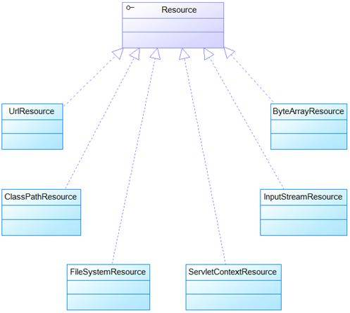

# - 策略模式

## 3-3. 策略模式

策略模式（Strategy Pattern）指的是：

> 针对一组算法，将每一个算法封装到具有共同接口的独立的类中，从而使得它们可以相互替换。策略模式使得算法可以在不影响到客户端的情况下发生变化。

策略模式是用来封装一系列的算法的，这些算法通常被封装在一个被称为Context的类中，客户端程序可以自由选择其中一种算法，或让Context为客户端选择一个最佳的算法。在策略模式中，一个类的行为或其算法可以在运行时更改，它的优势就是能够支持算法的自由切换。

Spring在“资源访问”这一问题上，就采用了策略模式。

Spring为资源访问提供了**Resource接口**，它是所有资源访问类所实现的接口。

Resource接口本身没有提供访问任何底层资源的实现逻辑，具体采用哪种策略实现资源访问，Resource 接口并不理会，针对不同的底层资源，Spring将会提供不同的Resource实现类，不同的实现类负责不同的资源访问逻辑。而客户端程序只和 Resource 接口耦合，并不知道底层采用何种资源访问策略，这样应用可以在不同的资源访问策略之间自由切换。

Spring 为 Resource 接口提供了如下实现类，这些实现类针对不同的的底层资源，提供了相应的资源访问逻辑，并提供便捷的包装，以利于客户端程序的资源访问：



在2-2部分中，我们提到，ApplicationContext之所以能够访问到一切外部资源，是因为它继承了ResourceLoader这个接口。ResourceLoader这个接口就是一个用来访问资源（比如类路径或者文件系统中的资源）的策略接口，我们来看它里面定义的方法：

```java
Resource getResource(String location); //用来获取资源，会返回一个resource实例
ClassLoader getClassLoader(); //用来获取该资源加载器所使用的类加载器
```

而ApplicationContext的实现类都实现ResourceLoader这个接口，因此 ApplicationContext就可用于直接获取 Resource 实例。此处 Spring 框架的 ApplicationContext 不仅是 Spring 容器，而且它还是资源访问策略的”决策者”，也就是策略模式中 Context 对象，它将为客户端代码”智能”地选择策略实现。

于是，当Spring应用需要进行资源访问时，并不需要直接使用Resource实现类，而是调用ApplicationContext实例的`getResource()`方法来获得资源，ApplicationContext会负责选择Resource的实现类，也就是确定具体的资源访问策略，从而将应用程序和具体的资源访问策略分离开来。 

举个例子，在下面的代码中，ApplicationContext是 ClassPathXmlApplicationContext，所以res就是ClassPathResource实例：

```java
ApplicationContext ctx = new ClassPathXmlApplicationContext("bean.xml");
Resource res = ctx.getResource("book.xml");
```

若将ApplicationContext改为FileSystemXmlApplicationContext，那么再次调用ctx.getResource时，res就是FileSystemResource实例，意味着从本地文件系统来加载 XML配置文件。

```java
ApplicationContext ctx = new Class FileSystemXmlApplicationContext("bean.xml");
```

同样的，如果ApplicationContext是XmlWebApplicationContext，那么res就是ServletContextResource 实例。

不过这样一来，当程序获取Resource实例时，总是需要提供Resource所在的位置，即使是通过ApplicationContext的`getResource()`方法也是一样。这就意味着：资源所在的物理位置将被耦合到代码中，如果资源位置发生改变，则必须改写程序。

那么，当Bean实例需要访问资源时，Spring还有没有更好的方法呢？

有的，那就是**依赖注入（DI）**，让Spring为Bean实例依赖注入资源。

我们可以在Bean中使用resource作为属性。下面代码的第3行定义了一个Resource类型的 res属性，该属性需要可以接受 Spring 的依赖注入。第6行parse\(\)方法用于解析res资源所代表的xml文件。

```java
public class TestBean
{
    private Resource res;
    // res的setter方法

    public void parse()throws Exception
    //用于解析res资源所代表的xml文件
    {
 
    }
}
```

然后就可以在ApplicationContext容器中配置这个TestBean，在该Bean的xml配置文件里指定资源文件的位置，此处可以使用一些前缀（如`classpath:`、`http:`）强制Spring采用某种资源访问策略（也就是指定具体使用哪个Resource实现类），如果不采用任何前缀，那么Spring就会采用与该ApplicationContext相同的资源访问策略来访问资源。

这样采用依赖注入，就能允许动态配置资源文件位置，无须将资源文件位置写在代码中，当资源文件位置发生变化时，无须改写程序，直接修改配置文件即可。

从这个意义上来看，Spring框架不仅充分利用了策略模式来简化资源访问，而且还将策略模式和依赖注入原则进行充分地结合，最大程度地简化了 Spring 资源访问。

