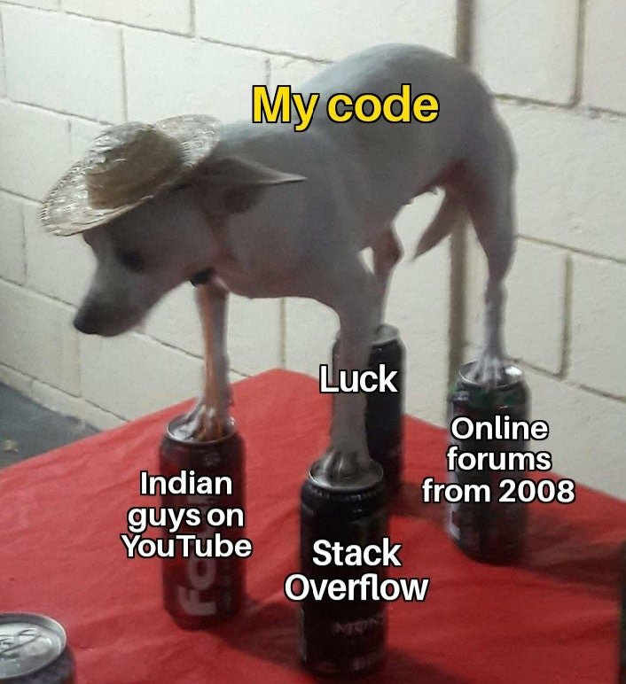

# Thinking in Spring

这篇文章是一篇Spring框架源码阅读报告，本文亦作为由王伟老师讲授的中国科学院大学“面向对象程序设计”课程平时作业，重点关注Spring framework的上下文管理模块（Context），旨在通过对源码的阅读与学习，体会Java语言特征的思想基础，一窥Spring框架的设计哲学，并领略其中华丽的面向对象程序设计思想。

由一名学浅才疏的、全然的Java语言初学者撰写而成的此文，必然是生涩的、是笨拙的、是挂一漏万的。因此，若您在阅读过程中发现任何您确信的错误，请不吝斧正。若您有任何意见和建议，也欢迎与我联系。谨受教，由是感激。

樊静  
January 8, 2021

  
联系邮箱：fanjing17@mails.ucas.ac.cn

Spring-context源码地址：[https://code.aliyun.com/xaigame-datacenter/spring-framework/tree/master/spring-context/src/main/java/org/springframework/context](https://code.aliyun.com/xaigame-datacenter/spring-framework/tree/c43e7497c18f46d1d5b13b62f286c63d40860c03/spring-context/src/main/java/org/springframework/context)

